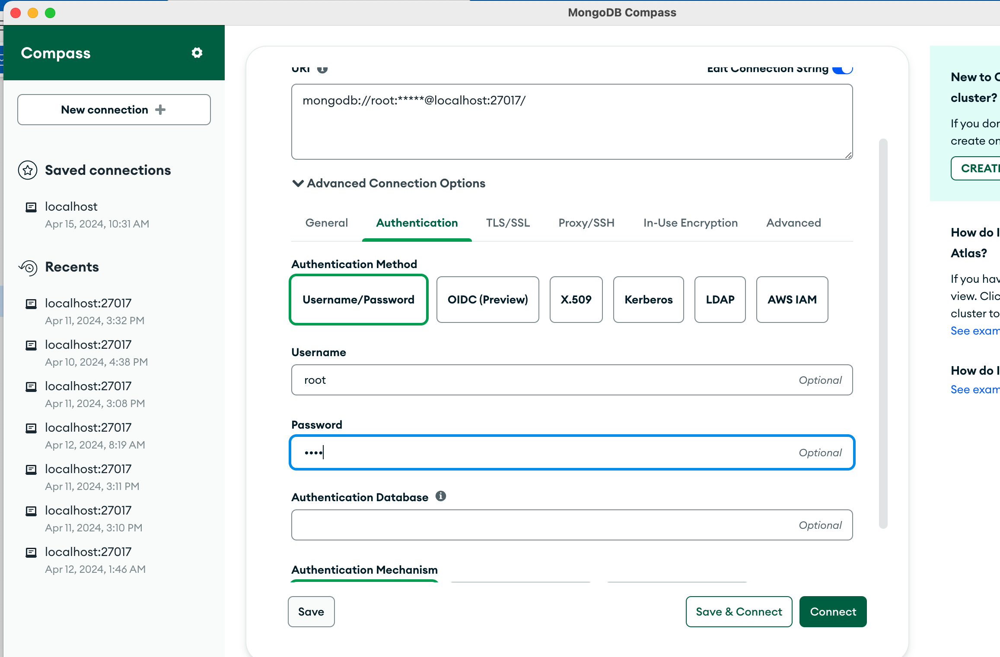
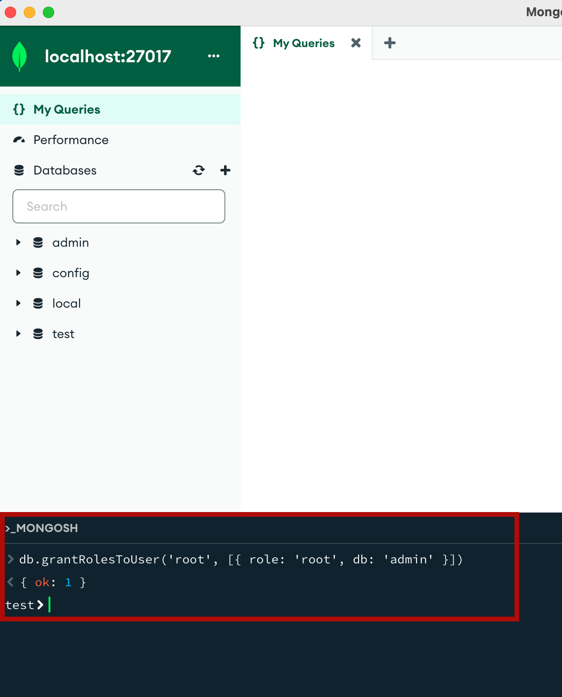

## To run this application, follow below steps

- Download node from here (required for your frontend)[node](https://nodejs.org/en/download)
- Use [visual studio code](https://code.visualstudio.com/)
- Mongo Compass from [here](https://www.mongodb.com/try/download/compass)
- Install [docker](https://www.docker.com/products/docker-desktop/)

1. Run Frontend
   - open terminal in your project folder
   - `cd frontend`
   - `npm i`
   - `npm start`
   Your frontend is now running on `localhost:3000`

2. Run Backend
   - open terminal in your project folder
   - `cd backend`
   - `pip install -r requirements.txt`   > `pip3 install -r requirements.txt` for mac users
   - `python api.py`  > `python3 install -r requirements.txt` for mac users
   - Your api is now ready at `localhost:8080`

3. Run Database
   - Make sure Docker Desktop is started and minimised. Then on your terminal
     `docker-compose up`

3. Your backend might be throwing `UnAuthorized` error. Open `Mongo Compass` and click on `MongoSH` at the bottom and run the following command:

	`db.grantRolesToUser('root', [{ role: 'root', db: 'admin' }])`

